# Mirantis Container Cloud Lens Extension


A [Lens](https://k8slens.dev/) extension that enables you to connect to management clusters and synchronize their resources into the Lens Catalog.

Requires Lens `>= 6.0.0` and Mirantis Container Cloud `>= 2.19`

> ⚠️ If you are upgrading from __extension__ version 3.x to 4.x, please see our [upgrade instructions](#upgrading-from-v3-to-v4) __before upgrading__.

## Installing

> 💬 If you plan on working on the extension code, follow the [development](./CONTRIBUTING.md#development) instructions instead of these.

Installation is very easy! Just make sure Lens is running, and follow these simple steps:

1. Switch to the Extensions view (`CMD+SHIFT+E` on macOS).
2. Enter the name of this extension, `@mirantis/lens-extension-cc`, into the __Install Extension__ box.
3. Click on the __Install__ button.
4. Make sure the extension is enabled.


You should now see a __Mirantis Container Cloud__ button in the top bar, on the right hand side. Click this button to access the extension's features.

## Upgrading

To upgrade to a newer release, go to the Extensions view (`CMD+SHIFT+E` on macOS), [uninstall](#uninstalling) the extension, and then [re-install](#installing) it again.

## Uninstalling

Go to the Lens Extensions view (`CMD+SHIFT+E` on macOS) and click the __Uninstall__ button next to this extension.

## SSO required

Mirantis Container Cloud instances that use third-party SSO authentication via __Keycloak__ are __required__ in order to use this extension.

The extension does not support management clusters using the old basic authentication method.

## Authorization flow

When connecting to a management cluster that uses SSO, Lens will open its SSO authorization page in your default browser.

Once authorized, Keycloak will redirect to the `lens://...` URL, triggering the browser to ask permission to open the Lens app to process the request (unless permission was granted previously with the _always allow_ check box for your SSO ID Provider, e.g. `accounts.google.com`):

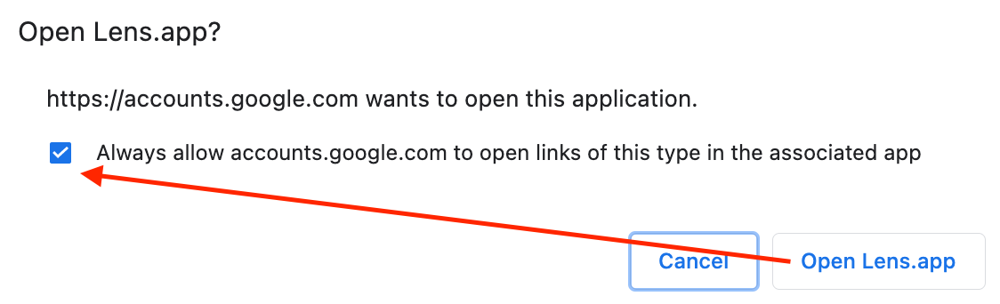

> ⚠️ Even if you check the "Always allow" box, your browser may still continue to show a popup message waiting for you to click on an "Open Lens.app" button. This is a built-in security feature. Please be on the look out for this popup in your browser whenever accessing your Container Cloud management cluster.

Whether the permission was already given, or upon clicking the __Open Lens.app__ button, Lens will receive focus again, and the extension will then obtain access to the management cluster.

The temporary browser window used for SSO authorization may still be open, and can now be closed manually.

## Tutorial

### Adding your first management cluster

Click on the __Mirantis Container Cloud__ button in the top bar, on the right side, to activate the extension.

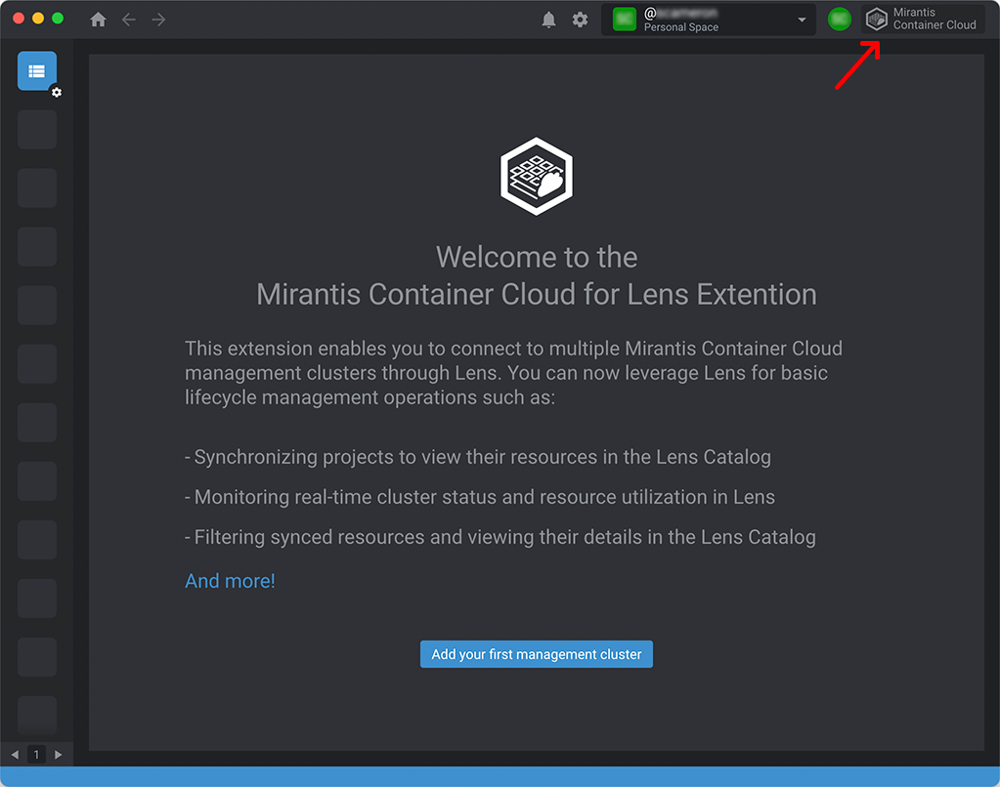

When there are no management clusters, you'll see the Welcome screen, as above. Click on the button at the bottom.

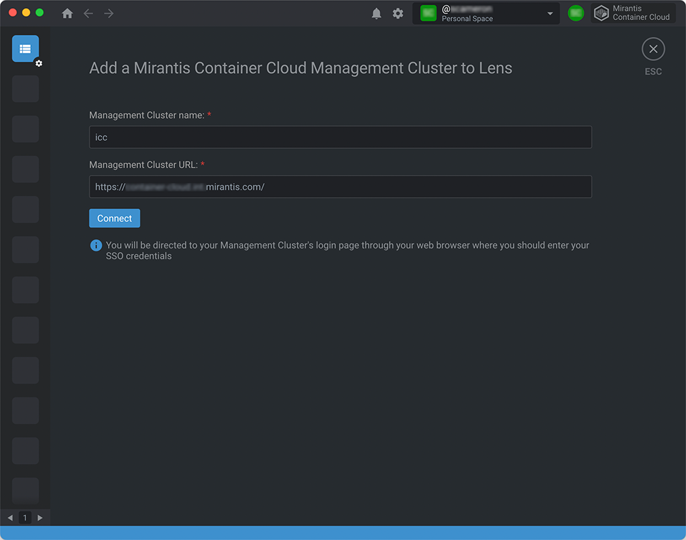

In the first field, enter a friendly name of your choice (no spaces or special characters allowed) for the management cluster you will connect to. This name will be used in Catalog labels to identify resources belonging to this management cluster in order to help with searching/filtering.

In the second field, enter the URL to the management cluster itself.

> ⚠️ By default, the extension will not connect to management clusters that use __self-signed certificates__. If that is your scenario, and you trust the endpoint, then see the [Security](#security) section for how to allow these connections.

When you click on __Connect__, your default browser will open to the management cluster's sign in screen.

Complete the sign in and you should then be redirected to Lens via a confirmation dialog like this (in your browser):


> Be sure to allow the redirect. Otherwise, the extension will fail to connect to the management cluster. If the browser window remains open, you can safely close it manually.

In a few seconds, the extension will list all the projects it discovered in the management cluster. These are the projects you can access with the account your used for sign in:

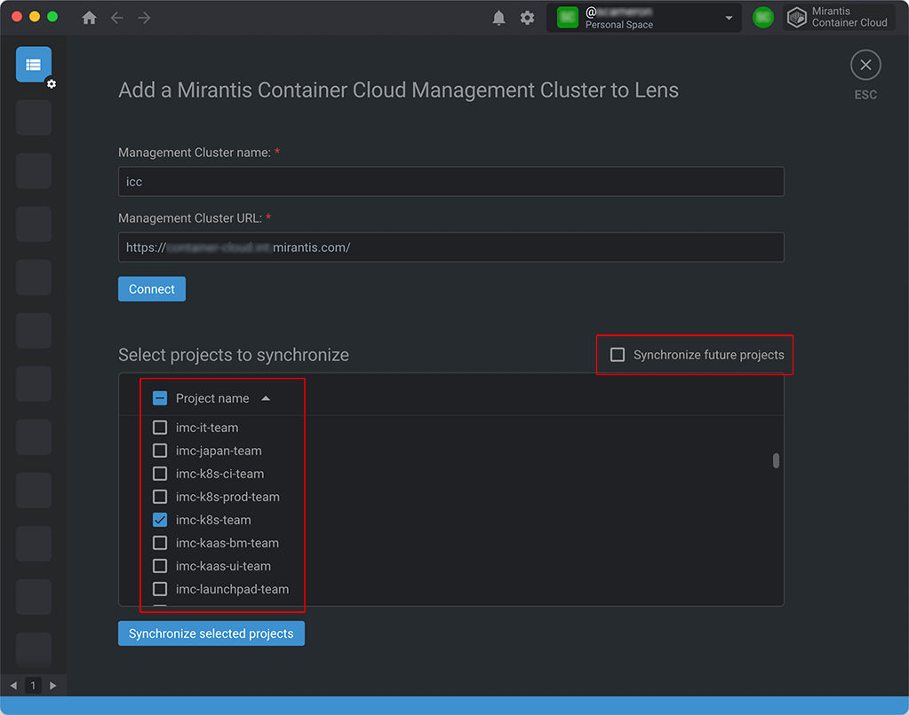

Make your project selection for synchronization, and choose whether __future projects__ should be automatically synced. This means that any projects created in the future will be automatically added to your sync selection, and their resources automatically added to the Catalog. Otherwise, new projects will be ignored.

> 💬 Deleting an existing, synced project from the Container Cloud API or browser UI will result in the project (and it's related resources) being removed from Lens automatically.

Finally, click on __Synchronize selected projects__ to complete the setup.

### Sync View

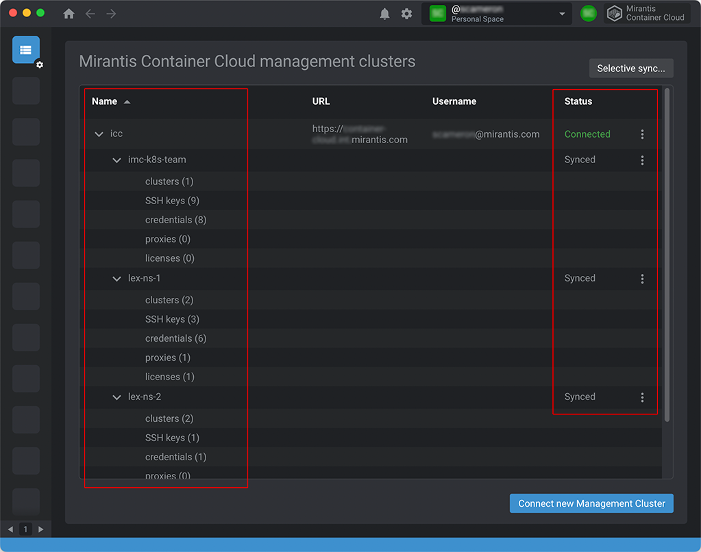

After adding a new management cluster, you'll be shown the __Sync View__. As highlighted, the __Name__ column on the far left shows the short name for the management cluster, along with all synced projects. Under each project, you'll find the number of resources that have been synced to Lens and are available in the Catalog.

The highlighted __Status__ column on the far right shows the current sync status of each project, as well as the connection status to the management cluster. As sync takes place periodically (every 5 minutes or so), the management cluster's status will change from "Connected" to "Updating" whenever it's synchronizing.

### Lens Catalog

Once the sync status is "Connected" and all projects are "Synced", head over to the Lens Catalog and choose __Clusters__ from the Category Browser on the left hand side. You should now see all the clusters that were synced (across all synced management clusters and projects):

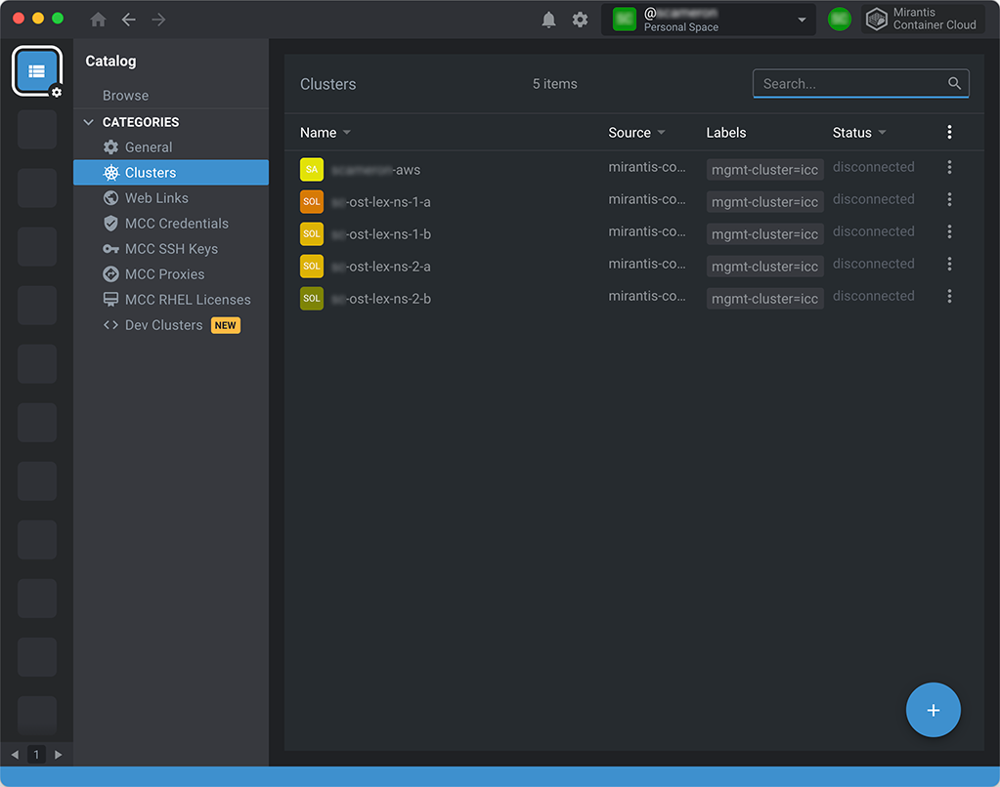

Notice there are new categories in the Category Browser:

- MCC Credentials
- MCC SSH Keys
- MCC Proxies
- MCC RHEL Licenses

These are simply quick filters on specific resource types, just like "Clusters" and "Web Links".

Click __Browse__ at the very top of the Category Browser to see all items in a single list. Use the __Search__ box at the top/right to filter.

For example, entering `project=NAME` (replace `NAME` with the name of a project you synced) in the Search box will filter the Catalog to show only those that belong to that project.

### Item details

To see details about any synced resource, use its context menu in the Catalog and choose __View details__:

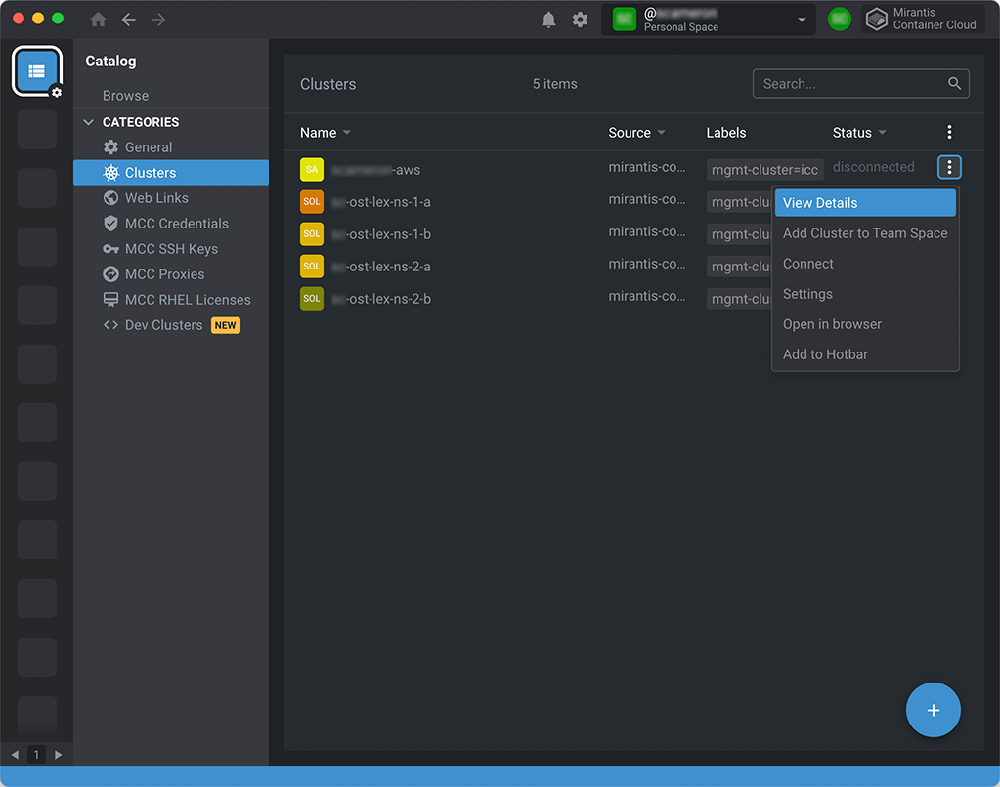

This will show a __Details panel__ with additional information about the resource. This is the same kind of information you would normally find in the Container Cloud browser UI. Here, we see the details for a cluster:

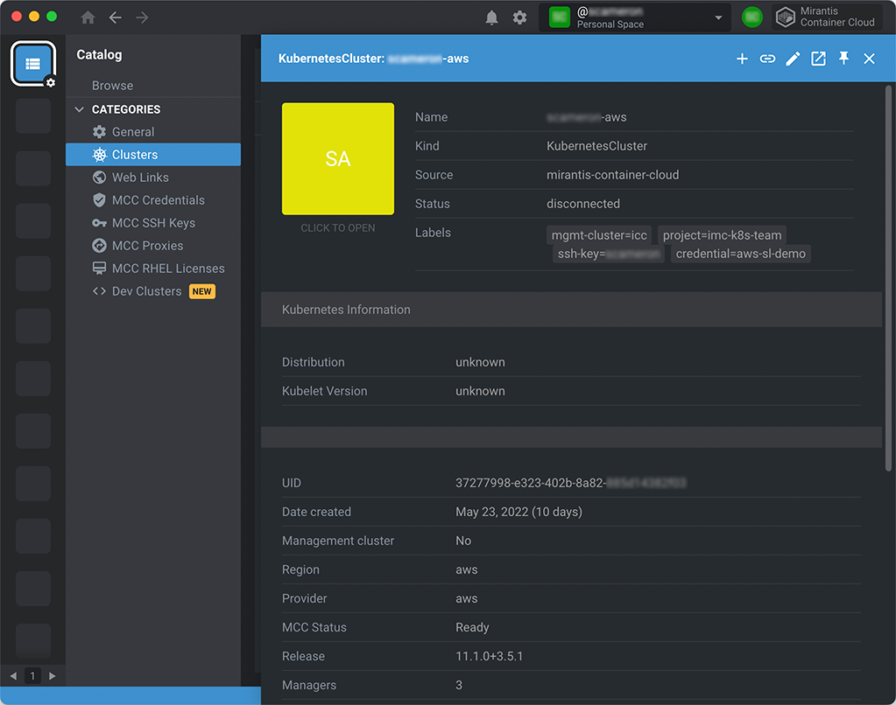

> 💬 There are `Status` and `MCC Status` fields: The difference is `Status` (near the top) represents the __Lens connection status__ (whether it's connected to the cluster to introspect its details via the [Cluster View](#cluster-metrics), while `MCC Status` (further down in a separate section)

### Cluster metrics

When you're ready to introspect a synced cluster, just click on it in the Catalog, same as you would any other cluster.

> 💬 Since Lens requires special credentials to access clusters and introspect them, your default browser window will open again, and you'll need to sign into the management cluster again. Once Lens has the special credentials, this shouldn't be necessary again until they expire.

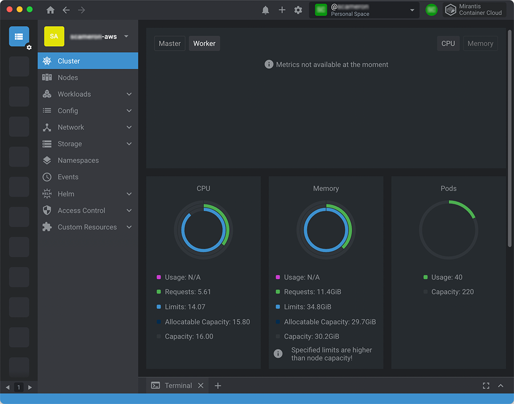

### Cluster pages

__New in v5.3.0__

When you're in the Lens cluster view, you can now find Mirantis Container Cloud-specific information in the __Container Cloud__ pages accessible at the bottom of the sidenav (highlighted in red below).

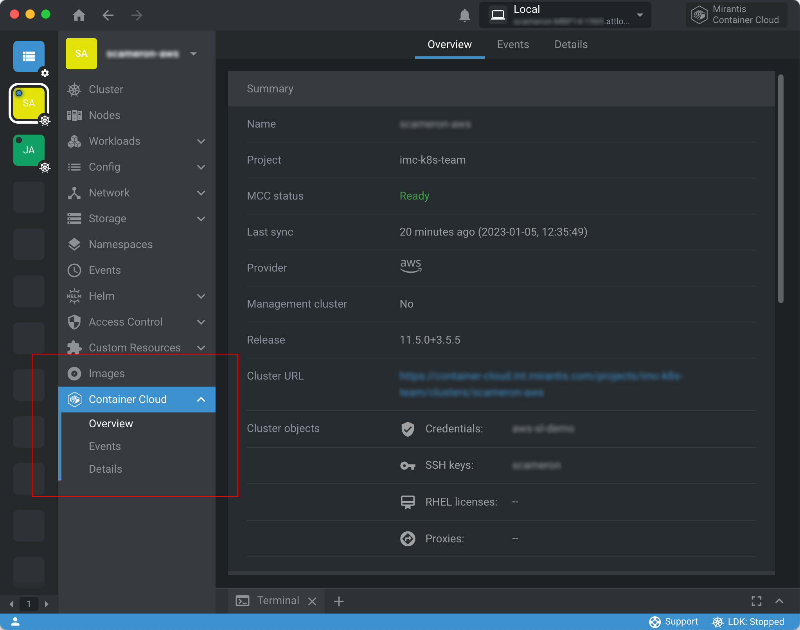

The overview page also provides information about all the cluster's conditions.

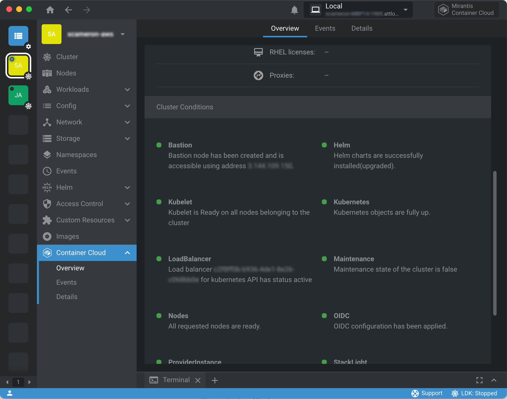

Cluster- and machine-related events are available in the second tab.

> 💡 The event list is updated every ~5 minutes. Click on the __Refresh__ button in the toolbar (highlighted in red below) to refresh the event list right away.


Finally, the details page provides all the information normally available from the Catalog's "View details" slide-in panel so that it isn't necessary to go back to the Catalog to get that data.

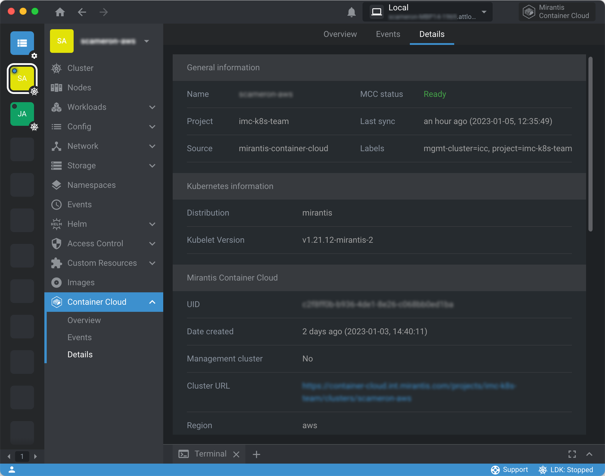

### Reconnecting a management cluster

If the management cluster becomes "Disconnected", it's simply because the user session used for connection and API access has expired and it needs to be reconnected. In this case, use the management cluster's context menu and choose the __Reconnect__ option:

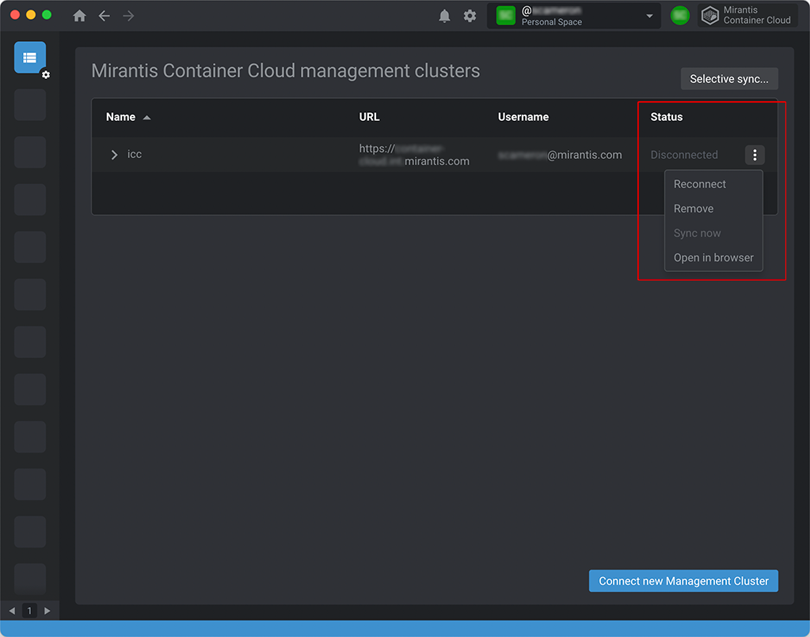

> 💬 As when adding a new management cluster, this will cause your default browser to open and you'll need to sign into the management cluster again. After the sign in is complete, you'll be redirected to Lens. If Lens doesn't re-focus, just re-focus the app. You can satefly close the browser window that was opened.

### Adding more management clusters

The extension can sync multiple management clusters at the same time. Click on the __Connect new Management Cluster__ button at the bottom/right corner of the [Sync View](#sync-view) to add more of them.

### Removing a management cluster

To remove a management cluster, choose the __Remove__ option from the management cluster's context menu in the [Sync View](#sync-view).

> ⚠️ Removing a management cluster will also remove all of its synced projects and resources from Lens.

### Update sync selection

To update the synchronization settings for any management cluster, click the __Selective sync__ button at the top/right corner of the [Sync View](#sync-view).

The screen will then update to show not only synced projects, but also ignored projects, where you'll be able to update your selections. The __future sync__ setting for each management cluster can also be changed from the Selective Sync view.

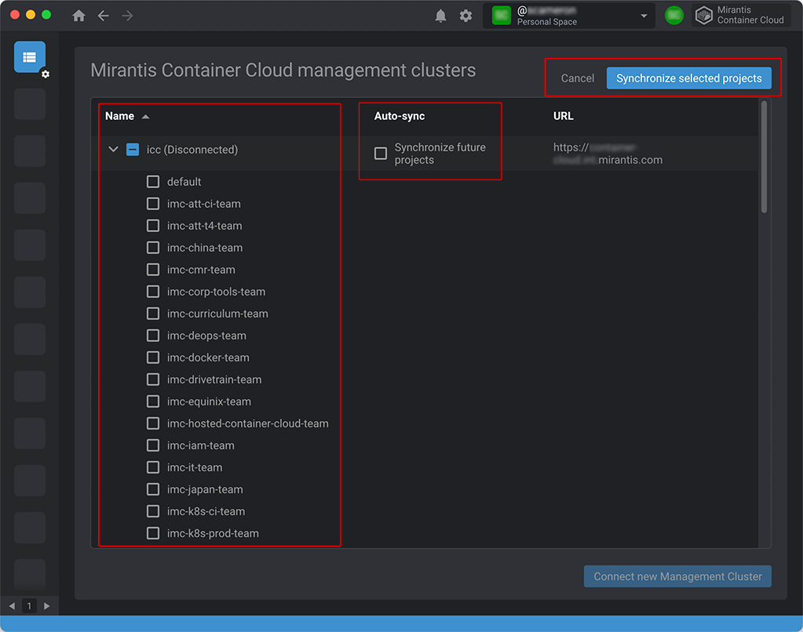

Once you've updated your selections, click the __Synchronize selected projects__ button at the top/right corner of the Selective Sync view.

Click __Cancel__ (next to the _Synchronize selected projects_ button) to back out without making any changes.

## Offline support

Whether a management cluster becomes "disconnected" and is not re-connected for a while, or Lens is closed for a long period of time, all resources that were last synced prior to disconnection or quitting the app will be kept in the Catalog and restored in Lens the next time it's opened.

Just reconnect when you're able and let the synchronization process update to the current state of things in order to keep your Catalog up-to-date.

## FAQ

- I was able to add my cluster to Lens, but Lens fails to show it because of an authentication error.
    - Check if the cluster is only accessible over a private network (i.e. VPN) connection, and try opening it in Lens once connected to the network. Even though you can see the cluster in Container Cloud, as well as in the extension, accessing the cluster's details may still require a VPN connection in this case.
- My management cluster gets disconnected after a while.
    - Access tokens (which are obtained by the extension when you [authorize access](#authorization-flow) to your management clusters) have a ~5 minute lifespan and come with refresh tokens that last up to ~30 minutes.
    - Typically, the extension is able to renew these tokens for a few hours, but once the renewal is no longer possible (for security reasons, a more recent authorization becomes necessary), a management cluster will become disconnected even while Lens is still running.
    - Quitting Lens for more than 30 minutes will definitely result in disconnection as the access token (which has a ~5 minute lifespan) as well as the refresh token, which has a ~30 minute lifespan, will both have expired.
- Lens keeps toggling my browser to authenticate with a synced cluster.
    - This appears to be an issue with Lens, not the extension. The kubeconfig provided to Lens for the synced cluster is valid, though it's different from kubeconfigs normally used by Lens in that it doesn't contain any offline tokens. Instead, it causes Lens to go through the `kube-login` binary (bundled with the extension) to obtain SSO tokens, and `kube-login` goes through your system's default browser to obtain those tokens.
    - Quitting and restarting Lens normally fixes the issue.
    - If the issue persists after quitting Lens (and leaving it closed because you don't need to use it for a while), then you may need to check for rogue Lens-related processes in your operating system's process explorer app and kill those lingering ones for the behavior to stop.

## Security

### Self-signed certificates

By default, the extension does not support management clusters that use self-signed certificates. They are treated as untrusted hosts for security reasons (because their identity cannot be verified).

There are some legitimate reasons to use self-signed certificates, however, and it is possible to enable the extension to skip certificate verification by starting Lens from the command line with a special `LEX_CC_UNSAFE_ALLOW_SELFSIGNED_CERTS` flag, where values of `1`, `true`, or `yes` will enable self-signed certificate support.

> ⚠️ Using this flag will also configure generated cluster kubeConfig files to skip TLS verification, and restarting Lens without the flag will not cause those kubeConfig files to be regenerated.
>
> To force all kubeConfigs to be regenerated with/without the setting, remove the project to which the cluster belongs from your sync settings, and re-add it. Removing the entire management cluster and re-adding it will also cause all kubeConfigs for all synced clusters belonging to it to be regenerated.

__macOS__

From a Terminal:

```bash
LEX_CC_UNSAFE_ALLOW_SELFSIGNED_CERTS=1 /Applications/Lens.app/Contents/MacOS/Lens
```

__Linux__

From a Terminal:

```bash
LEX_CC_UNSAFE_ALLOW_SELFSIGNED_CERTS=1 snap run lens
```

> 💬 This presumes a Snap-based installation. How to run Lens will differ if you used an alternate installation method.

__Windows__

From a Command Prompt:

```
set LEX_CC_UNSAFE_ALLOW_SELFSIGNED_CERTS=1
C:\Users\USERNAME\AppData\Local\Programs\Lens\Lens.exe
```

> 💬 Replace `USERNAME` with your Windows username.

## Upgrading from v3 to v4

### Manually added clusters no longer supported

As the extension underwent a near complete rewrite for version 4 which provides a completely new way of getting Mirantis Container Cloud clusters into Lens (manual, single selection to full synchronization across multiple management clusters), clusters previously added to Lens via the extension __are no longer supported__ and __will be removed__ from Lens upon upgrading.

__Before upgrading to v4__, be sure to take note of which clusters you added, and from which management cluster and project they came from, so you can [add those management clusters](#adding-your-first-management-cluster) and select those projects in order to have those clusters synced into Lens.

### Add to Lens from MCC no longer supported

The minimum supported version of Mirantis Container Cloud is `2.19` as the browser UI no longer has the old __Add to Lens__ cluster context menu item that the extension no longer supports.

If you're using an older version of MCC and attempt to use the _Add to Lens_ menu item in the browser UI, you will get an error message in the extension in Lens.

## Contributing

See our [contribution guide](./CONTRIBUTING.md).

## API

See our [API docs](./API.md).
