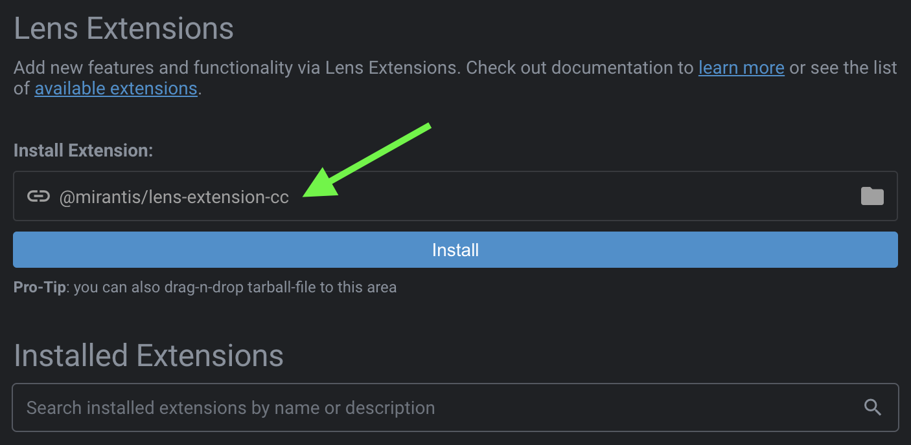

# ⚠️ Version 3 Maintenance ⚠️

For v3 (the currently-published version), please see [this README](https://github.com/Mirantis/lens-extension-cc/tree/v3-maint#readme) and code on the [v3-maint](https://github.com/Mirantis/lens-extension-cc/tree/v3-maint) branch. This branch will be maintained until v4 is published.

__The master branch will be used for v4 development__, which will introduce significant architectural changes that will make this extension even more useful and powerful for integrating Mirantis Container Cloud with the Lens IDE.

# Mirantis Container Cloud Lens Extension


This [Lens](https://k8slens.dev/) Extension adds a status bar item, and a menu item, that makes it easy to connect Lens to a Mirantis Container Cloud instance and add its clusters to Lens.

ℹ️ Requires Lens `>= 5.1.0`.


## Installing

Installation is very easy! Just make sure Lens `5.1.0` or later is running, and follow these simple steps:

1. Switch to the Extensions view (`CMD+SHIFT+E` on macOS).
2. Enter the name of this extension, `@mirantis/lens-extension-cc`, into the Install Extension box.
3. Click on the Install button.



You should now be able to choose the new `File > Add Cloud Clusters` menu item, or click on the `Mirantis Container Cloud` status bar icon (far right side of the status bar at the bottom of the app), to get started.

> 💬 These instructions will help you install the extension for direct use with Lens. Follow the [development](#development) instructions below if you intend to work on the extension to improve it.

## Upgrading

To upgrade to a newer release, go to the Extensions view (`CMD+SHIFT+E` on macOS), [uninstall](#uninstalling) the extension, and then [re-install](#installing) it again.

> 🚨 Up to, and including, __Lens 5.1.3__ (and probably some versions after that as well), __Lens must be restarted__ after upgrading the extension. This is __due to a bug in Lens__ that causes the extension's registration of [IPC event handlers](https://api-docs.k8slens.dev/v5.1.2/extensions/guides/ipc/) to be ignored, leading to an error message like "Failed to add cluster to Lens" after choosing a cluster and clicking on the "Add cluster" button. It will also manifest itself when choosing "Add cluster to lens" from the cluster's extended menu options in Mirantis Container Cloud v2.9 or later. [This Lens PR](https://github.com/lensapp/lens/pull/3505) tracks the fix.

## Uninstalling

Go to the Lens Extensions view (`CMD+SHIFT+E` on macOS) and click the Uninstall button next to this extension.

## Catalog

Lens 5 replaced its Workspace concept with a new Catalog that allows much more flexibility.

When adding clusters to Lens with this extension, each cluster will get the following labels:

- `mcc=true`
- `project=NAMESPACE` (set to the name of the project/namespace in Container Cloud to which the cluster belongs)

The extension also supports __removing__ and __deleting__ clusters that it added by choosing these items from the cluster's "More" context menu in the Catalog (as well as icons in the Catalog Drawer's toolbar):

- __Remove:__ Removes the cluster from the Catalog, but leaves the kubeConfig on disk in the configured location.
- __Delete config:__ Removes the cluster from the Catalog __and deletes__ the kubeConfig from disk.

In either case, __the cluster in Container Cloud is unaffected__. If you need to terminate the cluster, please do so in the Container Cloud web application.

## SSO support

📣 Mirantis Container Cloud instances that use third-party SSO authentication via __Keycloak__ are __required__ in order to use this extension.

### Keycloak Configuration

Since the integration leverages the `lens://` URL protocol handling feature for extensions, __Lens 4.2__ (or later) is required, and the __Keycloak Client__ of the instance must be configured as follows:

-   Allow the following redirect URI: `lens://extensions/@mirantis/lens-extension-cc/oauth/code`

> 💡 Be sure to make these configuration adjustments __on every Keycloak Client__ (`kaas` for the management cluster, and `k8s` for child clusters, by default) that manages clusters you will want to add. The extension does not know ahead of time whether you have given it the appropriate access, and adding clusters without this configuration will result in an error.

> 💬 __Mirantis Container Cloud 2.9__ configures the above for you __automatically__ so you should not have to do this if you're using 2.9 or later.

### Authentication flow

When connecting to an instance that uses SSO, Lens will open the instance's SSO authorization page in the system's default browser.

Once authorized, Keycloak will redirect to the `lens://...` URL, triggering the browser to ask permission to open the Lens app to process the request (unless permission was granted previously with the _always allow_ check box for your SSO ID Provider, e.g. `accounts.google.com`):


> ⚠️ Even if you check the "Always allow" box, your browser may still continue to show a popup message waiting for you to click on an "Open Lens.app" button. This is a built-in security feature. Please be on the look out for this popup in your browser whenever accessing your Container Cloud instance, or adding clusters to Lens.

Whether the permission was already given, or upon clicking __Open Lens.app__, Lens will receive focus again, and the extension will then read the list of namespaces and clusters and present them for selection.

The temporary browser window used for SSO authorization will likely still be open, and should now be closed manually.

### Single cluster limitation

Due to technical issues with generating a unique kubeConfig per cluster, when the Container Cloud instance uses SSO authorization, cluster selection is __limited to a single cluster__:


We hope to overcome this limitation in the future.

## Supported protocol requests

[Lens 4.2](https://medium.com/k8slens/lens-4-2-released-f1c3268d3f95) introduced a new __custom Lens protocol handler__. This means Lens can now respond to `lens://` URL requests made in the browser, and this extension can now support some interesting requests that enable tighter integration between Mirantis Container Cloud instances and Lens.

> Note that this integration is a one-way street: Container Cloud -> Lens. It does not work the other way around. _Reverse_ integration is achieved simply by making Container Cloud API requests from Lens, which is much easier to achieve, and has been used by this extension since its inception.

The __base URL__ for requests that this extension can respond to is:

```
lens://extensions/@mirantis/lens-extension-cc
```

The following APIs are currently supported by this extension, from the base URL above:

### Protocol - Activate cluster

Activates a cluster __already added__ to Lens.

```
GET /activateCluster
  ?cloudUrl={string}
  &namespace={string}
  &clusterName={string}
  &clusterId={string}
```

- `cloudUrl`: URL to the instance, e.g. `https://container-cloud.my-company.com`
- `namespace`: ID of the Container Cloud namespace containing the cluster to activate.
- `clusterName`: Name of the cluster to activate.
- `clusterId`: ID of the cluster (in `namespace`) to activate.

### Protocol - SSO OAuth Code

Allow the extension to use the system's default browser to broker an OAuth authorization code with a Keycloak client in a Container Cloud instance. This is used both for general access (to list clusters) as well as specific cluster access to generate kubeConfig files to add to Lens.

```
GET /oauth/code
  ?code={string}
  [ &state={string} ]
  [ &error={string} ]
  [ &error_description={string} ]
```

- `code`: Temporary authorization code to exchange for API tokens.
- `state` (Optional): Used to differentiate between requests for general access and specific access. The value is generated by the extension as part of the request and should come back as part of the response.
- `error` (Optional): OAuth error message, if an error occurs.
- `error_description` (Optional): OAuth error description, if an error occurs.

## FAQ

- Why are management clusters not selected by default?
    - The extension purposely doesn't not add management clusters to the default/initial set of selected clusters after retrieving clusters from a Mirantis Container Cloud instance because they are typically of less interest than workload clusters.
- I get an error, "Invalid redirect_uri", when I attempt to access or add my clusters.
    - Make sure you have properly [configured](#keycloak-configuration) all your Keycloak clients for use with the extension.
- Why can I only selected one cluster to add at a time?
    - See [Single cluster limitation](#single-cluster-limitation) when using SSO.
- I was able to add my cluster to Lens, but Lens fails to show it because of an authentication error.
    - Check if the cluster is only accessible over a private network (i.e. VPN) connection, and try opening it in Lens once connected to the network. Even though you can see the cluster in Container Cloud, as well as in the extension, accessing the cluster's details may still require a VPN connection in this case.
- Up to, and including, __Lens 5.1.3__ (and probably some versions after that as well), I get an error like, "Failed to add cluster to Lens" after choosing a cluster and clicking on the "Add cluster" button in the extension, or choosing the "Add cluster to Lens" cluster menu option in Mirantis Container Cloud v2.9 or later.
    - __Lens must be restarted__ after upgrading the extension. This is __due to a bug in Lens__ that causes the extension's registration of [IPC event handlers](https://api-docs.k8slens.dev/v5.1.2/extensions/guides/ipc/) to be ignored, leading to an error message like this. [This Lens PR](https://github.com/lensapp/lens/pull/3505) tracks the fix.

## Development

> __Yarn 1.x is required__

First, quit Lens if it's currently running.

Then, clone the repository wherever you prefer to have your code, and then link to it:

```bash
$ git clone https://github.com/Mirantis/lens-extension-cc.git /your/src/path
$ mkdir -p ~/.k8slens/extensions
$ ln -s /your/src/path ~/.k8slens/extensions/lens-extension-cc
$ cd /your/src/path
$ yarn       # install dependencies
$ yarn start # start dev build in watch mode
```

This will put the development build into watch mode.

Restart Lens and go to the Extensions View (`CMD+SHIFT+E` on macOS) to enable it, which will cause it to load for the first time.

Now, as you make source changes, the build will run, and __usually__ all you need to do is __reload the Lens window__ (`CMD+R` on macOS) to see your changes. If you make changes under `/src/main` (or any shared code that's used by that code), however, you will need to __restart Lens__ because code on the main thread does not get reloaded with `CMD+R`.

You can also run a one-off development build with `yarn dev`.

> Note these steps will get much easier once [this Lens issue](https://github.com/lensapp/lens/issues/1741) is fixed.

### Dev - Uninstalling

Go to the Lens Extensions View (`CMD+SHIFT+E` on macOS) and use the UI to uninstall it.

This will simply remove the symlink [you created](#development) in `~/.k8slens/extensions` and leave your linked directory intact.

### Dev - Publishing

First, __update the CHANGELOG__:

- Make sure everything in __UNRELEASED__ is accurate
- Change `UNRELEASED -> vX.Y.Z` (version that will be published)

Then __use NPM__:

```bash
$ npm version <patch|minor|major>
$ npm publish --access public        # <- NOTE the '--access public' part!
$ git push && git push --tags
```

> By default, packages published to an NPM scope/org are __private__. Use the `--access public` option to publish it as a public package instead. You can also [configure NPM](https://docs.npmjs.com/configuring-your-npm-client-with-your-organization-settings#setting-package-visibility-to-public-for-a-single-package) to always publish that single package publicly by running `npm config set access public` within the repository root directory (i.e. package root).

The `prepublishOnly` script will automatically produce a production build in the `./dist` directory, which will be published.
